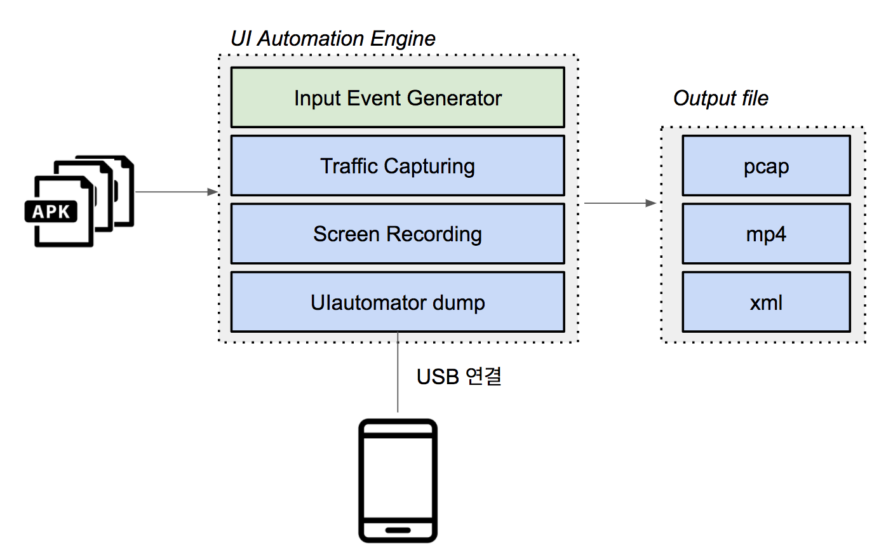
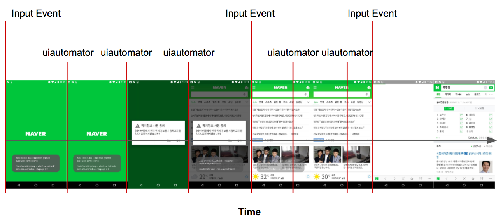

# Mobile Uiautomation Engine
다양한 앱 바이너리파일(.APK)들을 PC에 연결된 단말기에 자동으로 설치하고, UI입력을 발생시켜주는 테스팅 엔진입니다.
테스트를 진행하면서 수집하는 데이터는 트래픽데이터(.pcap), 단말기화면 영상(.mp4), 테스트 시간대별 uiautomator dump파일(.xml) 입니다.
테스트엔진을 사용해 자신이만든 앱이아닌 타인이만든 앱들에 대해서도 테스트할 수 있습니다.
해당 프로젝트는 모바일 어플리케이션에서 Speed Index를 구하기 위해 사용되는 테스팅 엔진입니다.

# Dependency
## 단말기(Mobile Device)
> Android 단말기
> Rooting(트래픽 데이터를 수집하기 때문에 관리자권한 필요)
> 단말기에 tcpdump를 설치해야 함
> Android SDK(adb 사용)

# Architecture

Mobile Uiautomation Engine 내부에는Input Event Generator, Traffic Capturing, Screen Recording, UIautomation dump  4가지 모듈이 존재합니다.
- Input Event Generator
    - PC에 연결된 단말기에 APK파일을 설치, 실행, 입력이벤트 발생, 삭제 명령을 내려주는 컨트롤러역할을 합니다.
- Traffic Capturing
    - 테스트가 진행되는 동안 tcpdump를 사용하여 트래픽을 수집합니다. 앱시작과 동시에 시작하여 앱종료와 함께 종료됩니다.
- Screen Recording
    - Traffic Capturing 모듈과 비슷하게 앱테스트 시작부터 종료까지 단말기 화면을 녹화합니다.
- Uiautomation dump
    - Input Event Generator를 통해 입력이벤트를 발생시킨 후 렌더링완료시점을 파악하기위해 UIautomator를 실행시켜 화면상의 노드개수를 파악해 줍니다.

# Flow

테스트는 다음과같이 진행됩니다.
네이버앱을 예시로 들자면 앱 실행명령을 내린 뒤, uiautomator 명령을 지속적으로 내려 화면상에 나타나는 노드개수를 파악합니다. uiautomator 를 3번 처리하는동안 노드개수가 변함이 없다면 렌더링이 완료되었다고 인지합니다. uiautomator 3번처리하는 시간은 평균적으로 6~8초정도 소요됩니다. 즉, 6초에서 8초동안 화면에 변화가 없으면 렌더링 완료로 탐지합니다. 렌더링완료라고 인지하면 다음입력이벤트를 발생시킵니다. 다음 입력이벤트는 현재화면에서 터치할 수 있는 요소들의 좌표로 입력이벤트를 내립니다. 해당 방식을 반복적으로 실행하여 특정 개수 이벤트 발생을 완료하면 테스트가 종료됩니다.

